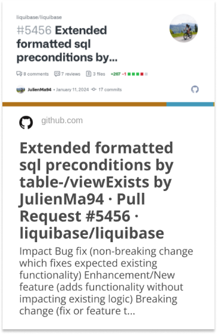

# Hi everyone :wave:

I am Julien from Freiburg, Germany.
I am currently working full time at [Exxeta](https://exxeta.com/) as an IT Consultant, and I'm passionate about Opensource projects, software development and road cycling.

_________________

🔭 <strong> I’m currently working on </strong>

Besides my job I am currently working on an Intellij Plugin for CorreoMQTT to create a better Developer Experience when working in projects with the MQTT Protocol.
If I have some spare time I am also working on Liquibase.

- [Liquibase](https://github.com/liquibase/liquibase)
- [CorreoMQTT](https://github.com/EXXETA/correomqtt)

<strong> Latest PRs </strong>

&nbsp;
&nbsp;
&nbsp;
&nbsp;

🌱 <strong> I’m currently learning </strong>

- Trying to get better at UX/UI Design
- Kotlin
- Neovim
- Intellij Plugin Development
- RxJs

📫 <strong> How to reach me </strong>

- [LinkedIn](https://www.linkedin.com/in/julien-marcq-b076b1180/)
- [Email](mailto:julien.marcq@exxeta.com)

